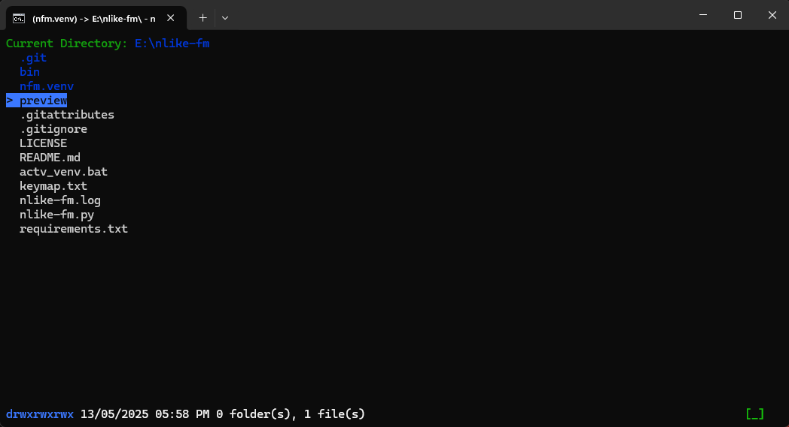

# NLike-FM - A Simple Terminal File Manager



NLike-FM is a lightweight terminal file manager designed with Nano-style simplicity. Unlike other terminal-based file managers that require a learning curve, NLike-FM mirrors traditional file manager shortcuts, making it easy to use for both new and experienced users.

## Installation

Clone the repository:

```bash
git clone https://github.com/8gudbits/nlike-fm.git
```

Install the required dependencies:

```bash
pip install -r requirements.txt
```

Run NLike-FM:

```bash
python nlike-fm.py [<tab1-path> <tab2-path> ...]
```

### Direct Download

If you prefer to run NLike-FM without installation, you can download the pre-built binaries:

- **Windows:** [Download nfm.exe](bin/windows/nfm.exe)
- **Linux:** [Download nfm](bin/linux/nfm)

After downloading, navigate to the folder and run:

```bash
nfm.exe [<tab1-path> <tab2-path> ...] # For Windows
./nfm   [<tab1-path> <tab2-path> ...] # For Linux
```

## Key Mappings

```
[ESC]        :   Exit NLike-FileManager.
[TAB]        :   Switch between tabs.
[1-9]        :   Switch to a specific tab.
[+]          :   Add a new tab.
[KEY_RIGHT]  :   Enter the selected directory.
[KEY_LEFT]   :   Go back to the previous directory.
[KEY_DOWN]   :   Scroll down in the current directory.
[KEY_UP]     :   Scroll up in the current directory.
[DELETE]     :   Delete the selected directory/file.
[P]          :   Copy the selected directory/file path.
[ENTER]      :   Open the selected directory/file.
[C]          :   Copy the selected directory/file.
[X]          :   Cut the selected directory/file.
[V]          :   Paste the copied/cut directory/file.
[KEY_F2]     :   Rename the selected directory/file.
[Z]          :   Undo the last action.
[Y]          :   Redo the last undone action.
[N]          :   Create a new empty file.
[SHIFT]+[N]  :   Create a new directory.
[F]          :   Search for a directory/file.
[SPACE]      :   Preview the selected file.
```

## Customization

You can modify `colors.py` to adjust file, folder, and UI colors.

Change colors to any curses-supported color:

- COLOR_BLACK
- COLOR_RED
- COLOR_GREEN
- COLOR_YELLOW
- COLOR_BLUE
- COLOR_MAGENTA
- COLOR_CYAN
- COLOR_WHITE.

## Compiling Your Own Binary

If you want to build a custom binary, follow these steps:

1. Install PyInstaller

```bash
pip install pyinstaller
```

2. Compile the Binary

```bash
pyinstaller --onefile --name=nfm nlike-fm.py
```

This generates an executable file in the dist folder. And now you have a customized version of NLike-FM that runs as a standalone binary!
